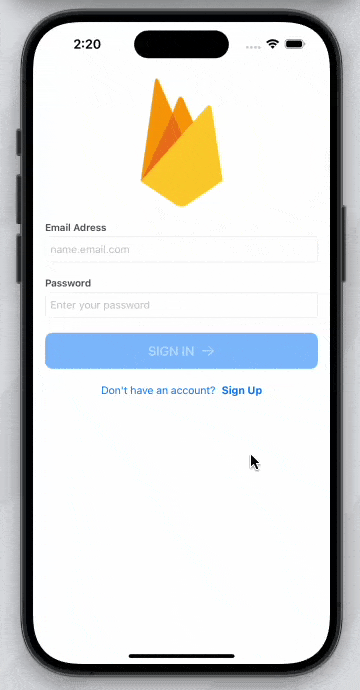

<!-- markdownlint-disable MD033 MD036 MD041 MD045 MD046 -->

<h1 style="border-bottom: none">
    <b><a href="#">SwiftUI Examples</a></b>
</h1>

A collection of examples project using ***`SwiftUI`***, ***`Combine`***, ***`Async/Await`***, ***`Animations`***, and more.

## Projects

### [*`> AuthFirebase/`*][AuthFirebase]

> [!NOTE]
> A complete example covering everything you need for user authentication with `Firebase`, including `login`, `signup`, `logout`, and `account deletion`, utilizing asynchronous programming with `async/await`.

### [*`> AuthMovieDB/`*][AuthMovieDB]

> [!NOTE]
> A simple example demonstrating how to authenticate with third-party services. This case uses `The Movie DB (TMDB)` API, showcasing the integration of an authentication service, secure session storage, and user profile management.

### [*`> StickyHeader/`*][StickyHeader]

> [!NOTE]
> A simple example demonstrating how to create a custom header. The header's appearance is dynamically controlled using a timer to track the scroll position and apply animation for a smooth transition. Credits to [**@kvsof**][kvsof-sticky-header] for the original implementation.

### [*`> SideMenu/`*][SideMenu]

> [!NOTE]
> A simple example demonstrating how to create a side menu with SwiftUI, featuring support for both light and dark modes.

## Contribute

Contributions are welcome. If you have project, make a pull request or create issue with link to repo.

## Facing any Issue?

Feel free to open an [Issue][issue] :)

## Contact

If you want to contact me you can reach me at [Discord][discord].

## License

MIT

[discord]: https://discord.com/users/744755977684779038
[issue]: https://github.com/ivansaul/Flutter-UI-Kit/issues
[AuthFirebase]: https://github.com/ivansaul/SwiftUI-Examples/tree/master/Projects/AuthFirebase
[AuthMovieDB]: https://github.com/ivansaul/SwiftUI-Examples/tree/master/Projects/AuthMovieDB
[StickyHeader]: https://github.com/ivansaul/SwiftUI-Examples/tree/master/Projects/StickyHeader
[SideMenu]: https://github.com/ivansaul/SwiftUI-Examples/tree/master/Projects/SideMenu
[kvsof-sticky-header]: https://youtu.be/PQD6z0bNeHo?si=AFEOpWxrKvQ3qGgK